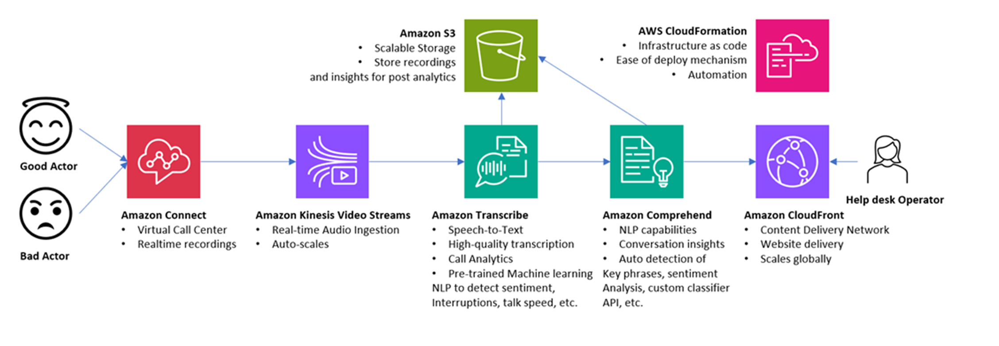

# Social Hacking Helper (SHH)
Social Hacking Helper is a cloud-based tool that can listen
in real-time to a help desk operator’s conversation with
a customer and illustrate in real-time a level of confidence
that the person to whom they are speaking with is in fact
malicious or not. Building this tool involves a great deal of
infrastructure architecture and natural language processing
algorithms using parts of speech, dictation, key phrases, and
patterns common among bad actors attempting to social engineer
a help desk operator within an organization.

## Architecture Overview

## Demo
[Demo Video](demo/cjackson42-social-hacking-helper.mp4)
<video src="demo/cjackson42-social-hacking-helper.mp4" width="720" height="480" controls>Your browser doesn't support video.</video>

## Academic Paper
[Academic Paper](presentation/final-report/cjackson42-final-report.pdf)

